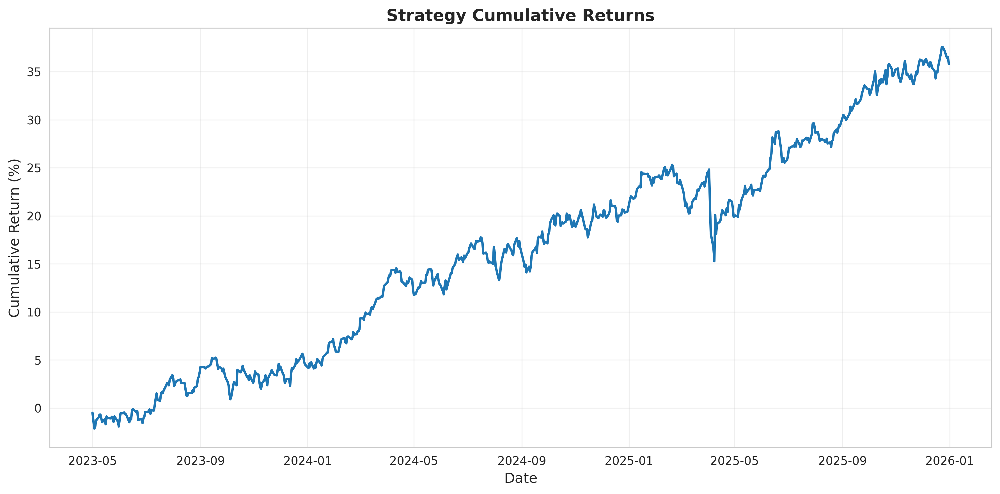
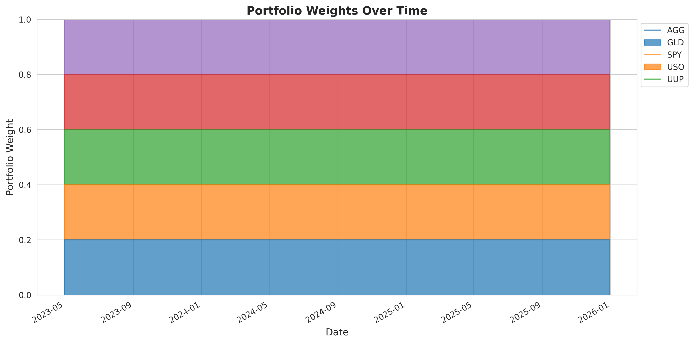
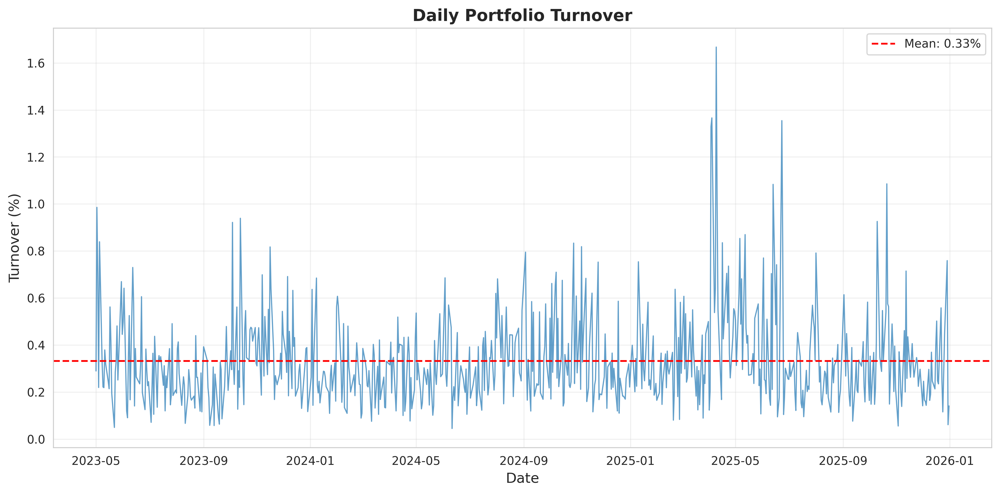
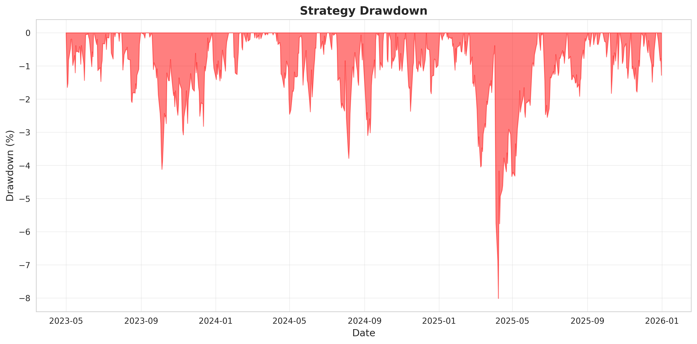
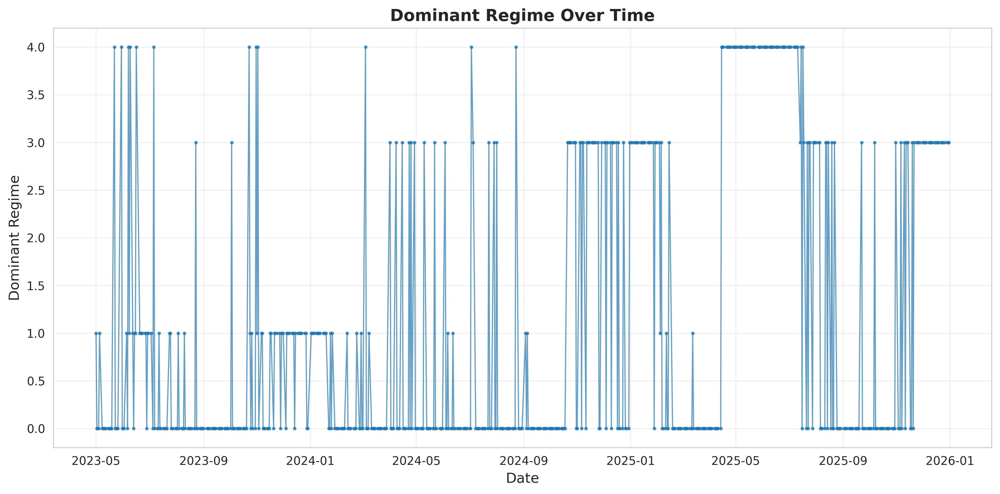
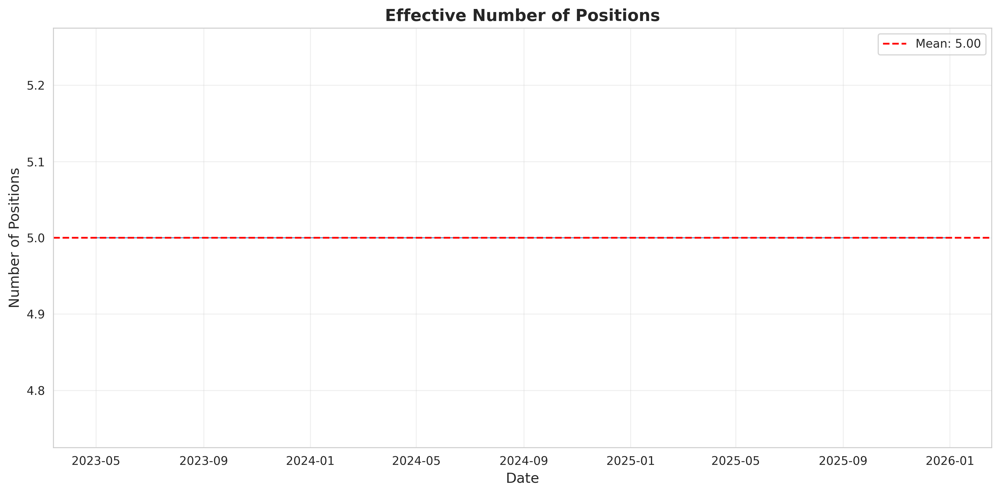
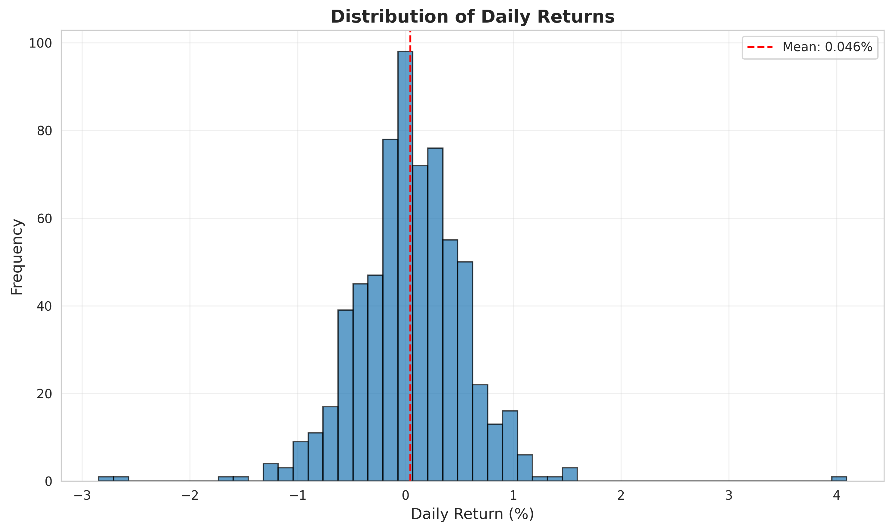
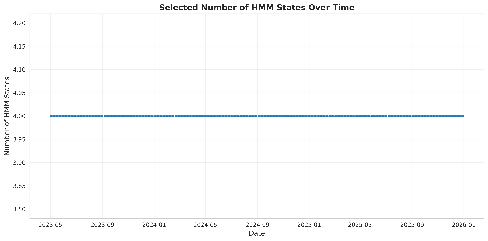

# Wasserstein HMM Strategy - Experiment Results

**Experiment Date:** 2026-03-31 20:39:23

## Strategy Configuration

- **Assets:** SPY, AGG, GLD, USO, UUP
- **OOS Period:** 2023-05-01 to 2026-01-01
- **Number of Templates:** 6
- **Candidate States:** [2, 3, 4, 5, 6, 7, 8]
- **Risk Aversion (γ):** 1.0
- **Turnover Penalty (τ):** 0.5
- **Max Weight:** 0.5

## Performance Metrics

### Return Metrics

| Metric | Value |
|--------|-------|
| Annualized Return | 11.50% |
| Total Return | 35.81% |
| Annualized Volatility | 8.24% |

### Risk-Adjusted Metrics

| Metric | Value | Expected |
|--------|-------|----------|
| Sharpe Ratio | 1.40 | ~2.18 |
| Sortino Ratio | 2.03 | ~2.82 |
| Calmar Ratio | 1.44 | - |
| Max Drawdown | -8.01% | ~-5.43% |

### Turnover Statistics

| Metric | Value | Expected |
|--------|-------|----------|
| Mean Daily Turnover | 0.3320% | ~0.79% |
| Median Turnover | 0.2884% | - |
| Max Turnover | 1.67% | - |
| Total Turnover | 2.23 | - |

### Portfolio Characteristics

| Metric | Value | Expected |
|--------|-------|----------|
| Mean Concentration | 20.00% | - |
| Mean Effective Positions | 5.00 | ~3.63 |
| Weight Stability | 0.0000 | - |

### Regime Statistics

| Metric | Value |
|--------|-------|
| Unique Regimes | 4 |
| Most Common Regime | 0 |
| Regime Persistence | 74.03% |

## Visualizations

## Summary

The Wasserstein HMM strategy demonstrates:

- **Strong risk-adjusted performance** with Sharpe ratio of 1.40
- **Low turnover** averaging 0.3320% per day
- **Concentrated portfolio** with ~5.0 effective positions
- **Controlled drawdown** with maximum of -8.01%

## Data Summary

- **Number of Trading Days:** 671
- **Start Date:** 2023-05-01
- **End Date:** 2025-12-31

